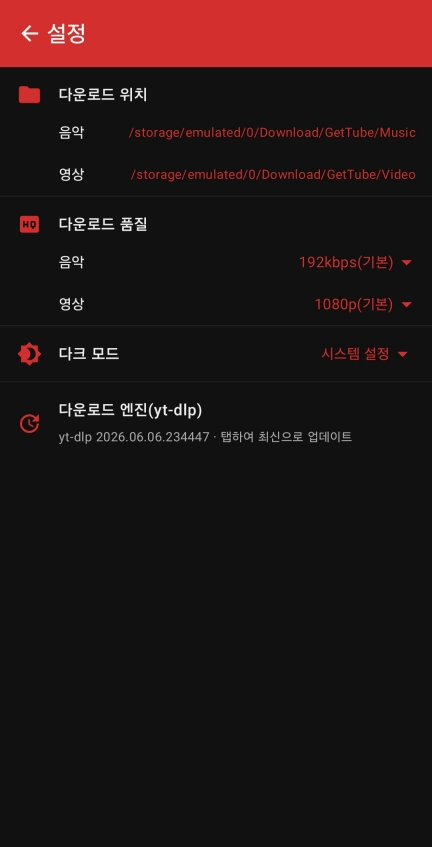
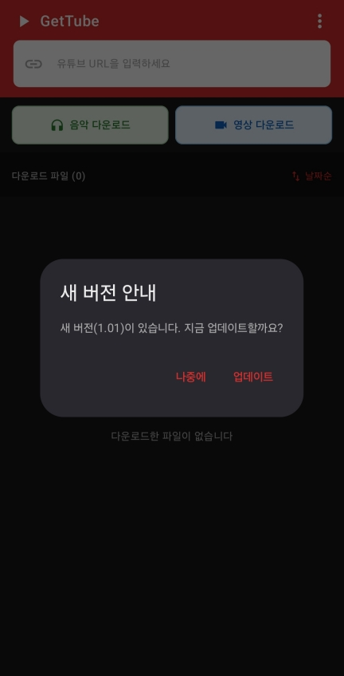

# GetTube

유튜브 주소를 참조하여 음원(MP3) / 영상(MKV)을 다운로드하는 안드로이드 앱입니다.

내부적으로 `yt-dlp` 다운로드 엔진과 `ffmpeg`를 네이티브로 실행하여, 유튜브 URL 하나만으로 오디오를 추출하거나 영상을 저장할 수 있습니다.

---

## 1. 앱 설명

- 유튜브 주소를 입력하면 해당 영상을 **음악(MP3)** 또는 **영상(MKV)** 파일로 다운로드합니다.
- 유튜브 앱의 **공유하기** 기능으로 GetTube를 선택하면, 공유된 URL이 입력창에 자동으로 채워집니다.
- 다운로드된 파일은 메인 화면 하단의 파일 목록에서 바로 확인하고 재생할 수 있습니다.
- 파일 종류별 저장 위치 · 품질 · 다크 모드 등을 설정에서 조정할 수 있습니다.

---

## 2. 기술 스택

| 구분 | 사용 기술 |
| --- | --- |
| 언어 | Kotlin |
| UI | Jetpack Compose, Material 3 |
| 아키텍처 | MVVM (ViewModel + Repository), Kotlin Coroutines |
| 다운로드 엔진 | [youtubedl-android](https://github.com/yausername/youtubedl-android) (`yt-dlp` 래퍼) + `ffmpeg` (MP3 추출 / 병합) |
| 빌드 | Gradle (Kotlin DSL), Version Catalog |

**빌드 환경**

- `minSdk` 24 / `targetSdk` 36 / `compileSdk` 36
- Java 11
- ABI Split: `arm64-v8a` 단일 APK 생성 (yt-dlp/python + ffmpeg 네이티브 바이너리 크기 최적화)

> `yt-dlp`가 네이티브 프로세스로 공용 `Download/GetTube` 폴더에 직접 파일을 쓰기 때문에,
> Android 11+ 에서는 **모든 파일 접근(MANAGE_EXTERNAL_STORAGE)** 권한이 필요합니다. 최초 실행 시 시스템 설정에서 허용합니다.

---

## 3. 메뉴 설명

### 메인 메뉴

- **URL 입력** : 유튜브 앱의 공유 기능으로 앱을 실행하면 주소가 자동 입력되며, 입력창에 직접 붙여넣을 수도 있습니다.
- **음악 다운로드** : 영상을 MP3 오디오로 추출하여 저장합니다.
- **영상 다운로드** : 영상을 MKV 파일로 저장합니다.
- **다운로드 목록** : 다운로드를 시작하면 하단 파일 목록에 추가되며, 진행률이 실시간으로 표시됩니다. 이름순 / 날짜순 / 크기순으로 정렬할 수 있습니다.

### 설정 메뉴

- **다운로드 위치** : 음악 / 영상 파일의 저장 폴더를 각각 선택합니다.
  - 음악 기본값 : `/storage/emulated/0/Download/GetTube/Music`
  - 영상 기본값 : `/storage/emulated/0/Download/GetTube/Video`
- **다운로드 품질**
  - 음악 : `192kbps(기본)` / `원본(무손실)`
  - 영상 : `1080p(기본)` / `720p` / `원본(최고 해상도)`
- **다크 모드** : `시스템 설정` / `라이트` / `다크`
- **다운로드 엔진(yt-dlp)** : 탭하여 yt-dlp 엔진을 최신 버전으로 업데이트합니다.

---

## 4. 앱 업데이트

앱 실행 시 **버전 정보 API 서버**를 조회하여, 설치된 버전보다 최신 버전이 있으면 자동으로 안내합니다.

- **자동 확인** : 앱이 시작될 때 API 서버에서 최신 릴리스 정보(버전 · APK 주소)를 받아 현재 설치 버전과 비교합니다.
- **새 버전 안내** : 더 새로운 버전이 있으면 `새 버전 안내` 다이얼로그가 떠서 업데이트 여부를 묻습니다.
  - **업데이트** : 최신 APK를 내려받은 뒤 시스템 설치 화면으로 연결해 최신 버전으로 교체합니다.
  - **나중에** : 이번에는 업데이트하지 않고 닫습니다.
- 네트워크 오류 등으로 버전 확인에 실패하더라도 앱 사용에는 영향을 주지 않습니다(조용히 무시).

> 이 기능은 앱 바이너리(APK) 전체를 새 버전으로 교체하는 흐름으로,
> 설정 메뉴의 **다운로드 엔진(yt-dlp) 업데이트**와는 별개입니다.
>
> APK는 알 수 없는 출처 설치를 거치므로, 최초 설치 시 시스템에서
> **출처를 알 수 없는 앱 설치 허용**을 요청할 수 있습니다.
